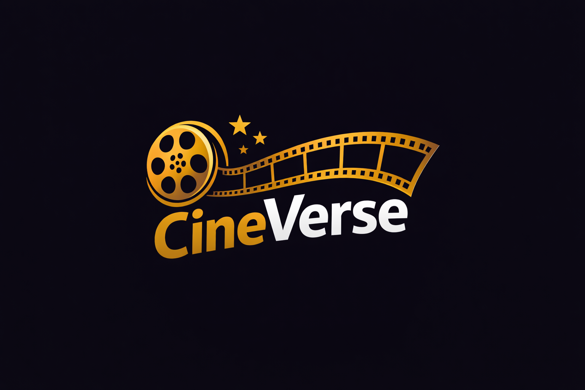

# 🎬 CineVerse - Cinema Booking System

A modern, full-featured cinema ticket booking system built with Laravel 12 and integrated with Midtrans payment gateway. CineVerse provides seamless movie browsing, seat selection, and secure online payment processing.



## ✨ Features

### User Features
- 🎥 **Browse Movies**: View now showing and upcoming movies with detailed information
- 🪑 **Interactive Seat Selection**: Real-time seat availability with visual seat map
- 💳 **Secure Payment**: Integrated with Midtrans Snap for multiple payment methods
- 🎫 **Digital Tickets**: View and manage your booking history
- ⭐ **Movie Reviews**: Rate and review movies you've watched
- 🔄 **Retry Payment**: Pay for pending bookings before showtime expires
- 🔔 **Real-time Updates**: Live seat availability and booking status

### Admin Features
- 📊 **Dashboard**: Overview of bookings, revenue, and analytics
- 🎬 **Movie Management**: Add, edit, and manage movie listings
- 📅 **Showtime Scheduling**: Create and manage movie showtimes
- 👥 **User Management**: View and manage registered users
- 💰 **Transaction Monitoring**: Track all booking transactions

## 🛠️ Tech Stack

### Backend
- **Framework**: Laravel 12.35.1
- **PHP**: 8.3.26
- **Database**: MySQL
- **Payment Gateway**: Midtrans Snap

### Frontend
- **Templating**: Blade
- **CSS Framework**: Bootstrap 5
- **JavaScript**: Vanilla JS
- **Icons**: Bootstrap Icons
- **Interactive UI**: Livewire

### Key Packages
- `midtrans/midtrans-php` - Payment processing
- `laravel/livewire` - Dynamic components
- `intervention/image` - Image processing

## 📦 Installation

### Prerequisites
- PHP >= 8.2
- Composer
- MySQL/MariaDB
- Node.js & NPM (optional, for asset compilation)

### Steps

1. **Clone the repository**
```bash
git clone https://github.com/Alifasulaeman13/cineverse.git
cd cineverse
```

2. **Install dependencies**
```bash
composer install
npm install # if using frontend build tools
```

3. **Environment setup**
```bash
cp .env.example .env
php artisan key:generate
```

4. **Configure your `.env` file**
```env
# Database
DB_CONNECTION=mysql
DB_HOST=127.0.0.1
DB_PORT=3306
DB_DATABASE=laravel_bioskop
DB_USERNAME=root
DB_PASSWORD=

# Application
APP_NAME=CineVerse
APP_URL=http://127.0.0.1:8000

# Midtrans (use your own credentials)
MIDTRANS_MERCHANT_ID=your_merchant_id
MIDTRANS_CLIENT_KEY=your_client_key
MIDTRANS_SERVER_KEY=your_server_key
MIDTRANS_IS_PRODUCTION=false
MIDTRANS_IS_SANITIZED=true
MIDTRANS_IS_3DS=true
```

5. **Run migrations and seeders**
```bash
php artisan migrate:fresh --seed
```

6. **Start the development server**
```bash
php artisan serve
```

7. **Access the application**
Open your browser and navigate to `http://127.0.0.1:8000`

## 🔑 Default Credentials

### Admin Account
- **Email**: admin@cineverse.com
- **Password**: admin123

### Test User Account
- **Email**: user@test.com
- **Password**: user123

## 💳 Midtrans Integration

### Sandbox Testing

Use these test credentials for payment testing:

**Credit Card**
- Card Number: `4811 1111 1111 1114`
- CVV: `123`
- Exp Date: Any future date

**E-Wallet (GoPay, ShopeePay, etc.)**
- Use sandbox accounts provided by Midtrans

### Production Setup

1. Register at [Midtrans Dashboard](https://dashboard.midtrans.com)
2. Get your production credentials
3. Update `.env`:
   ```env
   MIDTRANS_IS_PRODUCTION=true
   MIDTRANS_MERCHANT_ID=your_production_merchant_id
   MIDTRANS_CLIENT_KEY=your_production_client_key
   MIDTRANS_SERVER_KEY=your_production_server_key
   ```

## 📸 Screenshots

### Homepage
Modern cinema-themed landing page with featured movies

### Movie Browsing
Browse available movies with filters and search

### Seat Selection
Interactive seat map with real-time availability

### Payment Gateway
Secure payment via Midtrans Snap

### Ticket Management
View and manage your bookings

## 🎯 Key Functionalities

### Booking Flow
1. User browses available movies
2. Selects showtime and seats
3. Reviews booking details
4. Proceeds to payment via Midtrans
5. Receives digital ticket confirmation

### Payment Processing
- Real-time payment status updates
- Webhook integration for payment notifications
- Automatic seat reservation upon successful payment
- Timeout handling for pending payments

### Security Features
- Row-level locking to prevent race conditions
- Database transactions for atomic operations
- Signature verification for payment callbacks
- CSRF protection
- SQL injection prevention

## 📁 Project Structure

```
cineverse/
├── app/
│   ├── Http/Controllers/    # Application controllers
│   ├── Models/               # Eloquent models
│   ├── Services/             # Business logic services
│   └── Livewire/             # Livewire components
├── database/
│   ├── migrations/           # Database migrations
│   └── seeders/              # Database seeders
├── public/
│   └── images/posters/       # Movie poster images
├── resources/
│   └── views/                # Blade templates
└── routes/
    └── web.php               # Web routes
```

## 🚀 Deployment

### Production Checklist
- [ ] Set `APP_ENV=production` in `.env`
- [ ] Set `APP_DEBUG=false` in `.env`
- [ ] Configure production database
- [ ] Set up Midtrans production credentials
- [ ] Configure proper file permissions
- [ ] Set up SSL certificate (HTTPS)
- [ ] Configure server (Apache/Nginx)
- [ ] Set up backup strategy
- [ ] Configure logging and monitoring

## 🤝 Contributing

Contributions are welcome! Please feel free to submit a Pull Request.

## 📝 License

This project is open-sourced software licensed under the [MIT license](https://opensource.org/licenses/MIT).

## 👨‍💻 Developer

**Alifa Sulaeman**
- GitHub: [@Alifasulaeman13](https://github.com/Alifasulaeman13)

## 🙏 Acknowledgments

- Laravel Framework
- Midtrans Payment Gateway
- Bootstrap Team
- All open-source contributors

---

⭐ If you find this project useful, please consider giving it a star on GitHub!

**Built with ❤️ using Laravel**
